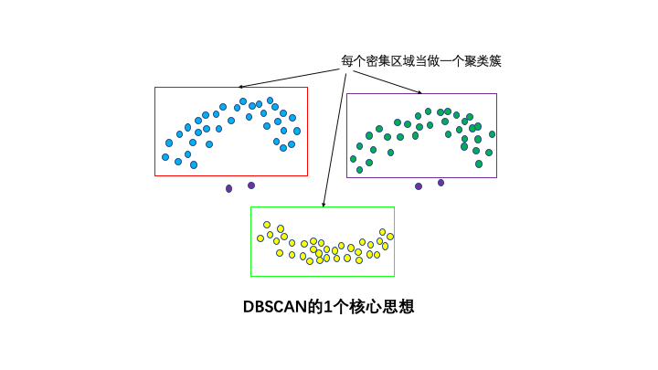
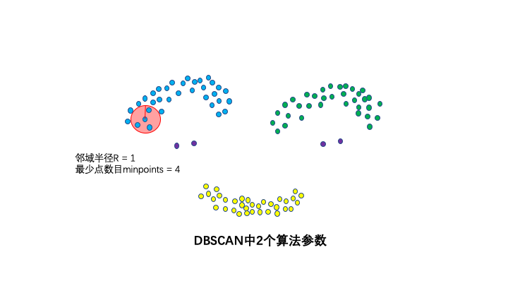
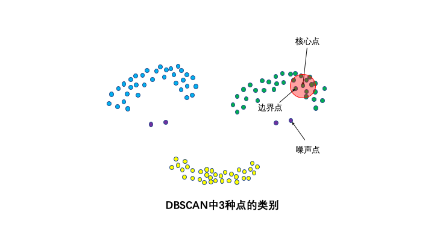
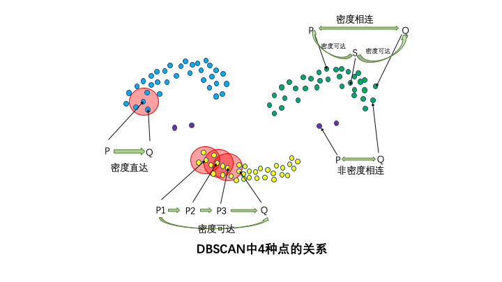
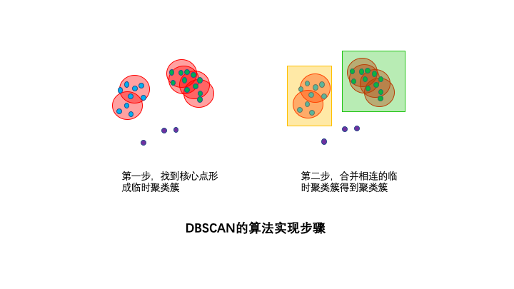
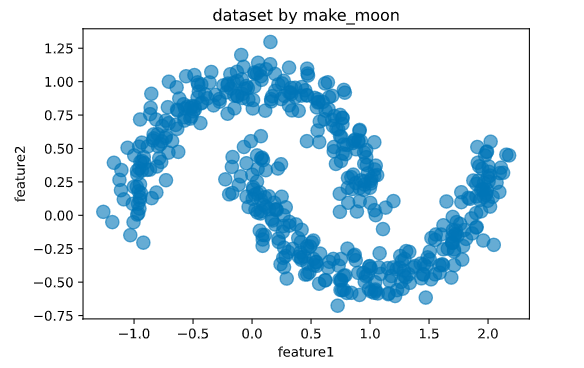
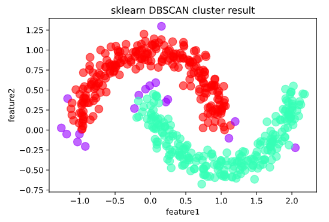
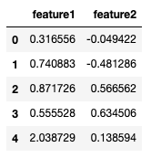
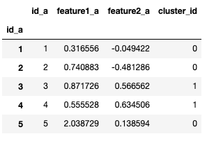
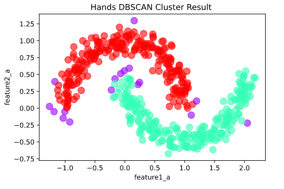

---
jupyter:
  jupytext:
    text_representation:
      extension: .md
      format_name: markdown
      format_version: '1.2'
      jupytext_version: 1.4.1
  kernelspec:
    display_name: Python 3
    language: python
    name: python3
---

## 20分钟学会DBSCAN聚类算法


DBSCAN是一种非常著名的基于密度的聚类算法。其英文全称是 Density-Based Spatial Clustering of Applications with Noise，意即：一种基于密度，对噪声鲁棒的空间聚类算法。直观效果上看，DBSCAN算法可以找到样本点的全部密集区域，并把这些密集区域当做一个一个的聚类簇。

DBSCAN算法具有以下特点：

* 基于密度，对远离密度核心的噪声点鲁棒

* 无需知道聚类簇的数量

* 可以发现任意形状的聚类簇

DBSCAN通常适合于对较低维度数据进行聚类分析。

```python

```

### 一，基本概念


DBSCAN的基本概念可以用1，2，3，4来总结。

1个核心思想：基于密度。直观效果上看，DBSCAN算法可以找到样本点的全部密集区域，并把这些密集区域当做一个一个的聚类簇。





2个算法参数：邻域半径R和最少点数目MinPoints。这两个算法参数实际可以刻画什么叫密集：当邻域半径R内的点的个数大于最少点数目R时，就是密集。





3种点的类别：核心点，边界点和噪声点。邻域半径R内样本点的数量大于等于minpoints的点叫做核心点。不属于核心点但在某个核心点的邻域内的点叫做边界点。既不是核心点也不是边界点的是噪声点。





4种点的关系：密度直达，密度可达，密度相连，非密度相连。

如果P为核心点，Q在P的R邻域内，那么称P到Q密度直达。任何核心点到其自身密度直达，密度直达不具有对称性，如果P到Q密度可达，那么Q到P不一定密度可达。

如果存在核心点P2，P3，……，Pn，且P1到P2密度直达，P2到P3密度直达，……，P(n-1)到Pn密度直达，Pn到Q密度直达，则P1到Q密度可达。密度可达也不具有对称性。

如果存在核心点S，使得S到P和Q都密度可达，则P和Q密度相连。密度相连具有对称性，如果P和Q密度相连，那么Q和P也一定密度相连。密度相连的两个点属于同一个聚类簇。

如果两个点不属于密度相连关系，则两个点非密度相连。非密度相连的两个点属于不同的聚类簇，或者其中存在噪声点。




```python

```

### 二，算法步骤


DBSCAN的算法步骤分成两步。

1，寻找核心点形成临时聚类簇。

扫描全部样本点，如果某个样本点R半径范围内点数目>=MinPoints，则将其纳入核心点列表，并将其密度直达的点形成对应的临时聚类簇。

2，合并临时聚类簇得到聚类簇。

对于每一个临时聚类簇，检查其中的点是否为核心点，如果是，将该点对应的临时聚类簇和当前临时聚类簇合并，得到新的临时聚类簇。

重复此操作，直到当前临时聚类簇中的每一个点要么不在核心点列表，要么其密度直达的点都已经在该临时聚类簇，该临时聚类簇升级成为聚类簇。

继续对剩余的临时聚类簇进行相同的合并操作，直到全部临时聚类簇被处理。




```python

```

### 三，sklearn调包范例


1,生成样本点

```python
%matplotlib inline
%config InlineBackend.figure_format = 'svg'
import numpy as np
import pandas as pd
from sklearn import datasets


X,_ = datasets.make_moons(500,noise = 0.1,random_state=1)
df = pd.DataFrame(X,columns = ['feature1','feature2'])

df.plot.scatter('feature1','feature2', s = 100,alpha = 0.6, title = 'dataset by make_moon');
```



```python

```

2，调用dbscan方法完成聚类

```python
%matplotlib inline
%config InlineBackend.figure_format = 'svg'

from sklearn.cluster import dbscan

# eps为邻域半径，min_samples为最少点数目
core_samples,cluster_ids = dbscan(X, eps = 0.2, min_samples=20) 
# cluster_ids中-1表示对应的点为噪声点

df = pd.DataFrame(np.c_[X,cluster_ids],columns = ['feature1','feature2','cluster_id'])
df['cluster_id'] = df['cluster_id'].astype('i2')

df.plot.scatter('feature1','feature2', s = 100,
    c = list(df['cluster_id']),cmap = 'rainbow',colorbar = False,
    alpha = 0.6,title = 'sklearn DBSCAN cluster result');

```



```python

```

### 四，手工实现范例


前方高能提醒。

下面使用Python和Pandas手工实现DBSCAN聚类算法。

看懂这个实现需要对Pandas的相关操作相当熟悉，并且对DBSCAN的算法细节有深入的了解。

这个实现和sklearn中的实现有所不同，适当拓展可以在spark上进行分布式实现。

实践中一般掌握DBSAN的基本原理和调包方法就够用了。无相关基础的同学可以跳过该部分。


**1，生成样本点**

```python
import numpy as np
import pandas as pd
from sklearn import datasets
%matplotlib inline

X,_ = datasets.make_moons(500,noise = 0.1,random_state=1)
df = pd.DataFrame(X,columns = ['feature1','feature2'])

df.head()
```



```python

```

**2，计算样本点中两两之间的距离**

```python
dfdata = df.copy()
dfdata.columns = ["feature1_a","feature2_a"]
dfdata["id_a"] = range(1,len(df)+1)
dfdata = dfdata.set_index("id_a",drop=False)
dfdata = dfdata.reindex(columns=["id_a","feature1_a","feature2_a"])

dfdata.head()
```


```python
dfpairs = pd.DataFrame(columns = ["id_a","id_b","distance_ab"])

q = dfdata.loc[:,["feature1_a","feature2_a"]].values 

for i in dfdata.index:
    p = dfdata.loc[i,["feature1_a","feature2_a"]].values 
    dfab = dfdata[["id_a"]].copy()
    dfab["id_b"] = i
    dfab["distance_ab"] = np.sqrt(np.sum((p -q )**2,axis = 1))
    dfpairs = pd.concat([dfpairs,dfab])

dfpairs.head()
```


```python

```

**3，构造临时聚类簇**

```python
dfnears = dfpairs.query("distance_ab<0.2")

dfglobs = dfnears.groupby("id_a").agg({"id_b":[len,set]})
dfglobs.columns = ["neighbours_cnt","neighbours"]
dfglobs = dfglobs.query("neighbours_cnt>=20")
dfglobs = dfglobs.reset_index()

# 找到核心点id
core_ids = set(dfglobs["id_a"])
dfcores = dfglobs.copy()

# 剔除非核心点的id
dfcores["neighbours"] = [x & core_ids for x in dfcores["neighbours"]]
dfcores.head()

```


```python

```

**4，合并相连的临时聚类簇得到聚类簇**

```python
#定义合并函数：将有共同核心点的临时聚类簇合并

def mergeSets(set_list):
    result = []
    while  len(set_list)>0 :
        cur_set = set_list.pop(0)
        intersect_idxs = [i for i in list(range(len(set_list)-1,-1,-1)) if cur_set&set_list[i]]
        while  intersect_idxs :
            for idx in intersect_idxs:
                cur_set = cur_set|set_list[idx]

            for idx in intersect_idxs:
                set_list.pop(idx)
                
            intersect_idxs = [i for i in list(range(len(set_list)-1,-1,-1)) if cur_set&set_list[i]]
        
        result = result+[cur_set]
    return result
    
```

```python
# 测试mergeSets效果
test_set_list = [{1,2,3},{3,4,5},{10,12,13},{4,5,8},{13,15},{7,8},{20,22}]
print(mergeSets(test_set_list))
```

```
[{1, 2, 3, 4, 5, 7, 8}, {10, 12, 13, 15}, {20, 22}]
```

```python
set_list = list(dfcores["neighbours"])
result = mergeSets(set_list)
core_clusters = {i:s for i,s in enumerate(result)}
print(core_clusters)
```

```
{0: {1, 2, 5, 7, 11, 15, 17, 21, 22, 24, 26, 32, 34, 35, 39, 40, 41, 42, 43, 45, 46, 47, 48, 49, 54, 55, 57, 58, 60, 61, 64, 65, 66, 67, 68, 69, 72, 76, 84, 87, 88, 90, 91, 92, 93, 95, 103, 105, 111, 112, 113, 114, 117, 120, 121, 124, 126, 128, 133, 135, 136, 137, 139, 144, 146, 160, 163, 164, 165, 169, 170, 173, 182, 183, 185, 190, 194, 196, 198, 200, 201, 202, 203, 206, 210, 213, 227, 228, 229, 230, 231, 233, 234, 235, 238, 245, 246, 248, 249, 250, 251, 252, 255, 256, 257, 258, 259, 261, 264, 267, 270, 275, 283, 289, 292, 293, 295, 296, 297, 307, 312, 313, 316, 323, 326, 327, 328, 332, 334, 335, 339, 341, 343, 346, 349, 351, 356, 357, 365, 366, 368, 373, 374, 377, 379, 384, 385, 387, 391, 394, 396, 403, 409, 411, 415, 417, 418, 419, 427, 429, 434, 435, 437, 438, 442, 444, 446, 448, 457, 458, 462, 473, 474, 477, 478, 479, 484, 488, 491, 492, 498}, 1: {3, 8, 10, 12, 14, 16, 19, 20, 25, 27, 29, 31, 44, 51, 52, 53, 56, 59, 62, 73, 74, 75, 80, 82, 85, 96, 97, 98, 100, 104, 110, 116, 118, 119, 122, 125, 132, 134, 141, 142, 143, 147, 148, 149, 150, 152, 154, 158, 159, 167, 168, 171, 172, 174, 175, 176, 177, 178, 180, 184, 188, 191, 195, 197, 204, 205, 207, 209, 211, 212, 216, 217, 218, 220, 222, 226, 232, 237, 244, 253, 254, 266, 268, 269, 272, 274, 276, 277, 279, 280, 281, 282, 284, 286, 287, 290, 291, 294, 298, 301, 302, 303, 306, 308, 310, 311, 317, 318, 319, 320, 321, 322, 324, 325, 329, 331, 337, 342, 344, 345, 347, 348, 350, 352, 354, 358, 359, 360, 361, 362, 363, 364, 370, 371, 372, 376, 378, 381, 383, 386, 389, 398, 401, 406, 408, 412, 413, 414, 416, 420, 421, 425, 428, 430, 431, 433, 436, 440, 445, 449, 450, 454, 456, 464, 466, 470, 471, 472, 483, 486, 487, 489, 490, 494, 497, 499, 500}}
```

```python

```

5，关联所有样本点

```python
core_map = {}
for k,v in core_clusters.items():
    core_map.update({vi:k for vi in v})

cluster_map = {}
for i in range(len(dfglobs)):
    id_a = dfglobs["id_a"][i]
    neighbours = dfglobs["neighbours"][i]
    cluster_map.update({idx:core_map[id_a] for idx in neighbours})

print(len(cluster_map))
```

```
483
```

```python

```

```python
dfdata["cluster_id"] = [cluster_map.get(id_a,-1) for id_a in dfdata["id_a"]]
dfdata.head()
```



```python
# 可视化样本点的聚类结果，可以看到和sklearn中的结果完全一致。

dfdata.plot.scatter('feature1_a','feature2_a', s = 100,
    c = list(dfdata['cluster_id']),cmap = 'rainbow',colorbar = False,
    alpha = 0.6,title = 'Hands DBSCAN Cluster Result ');

```


