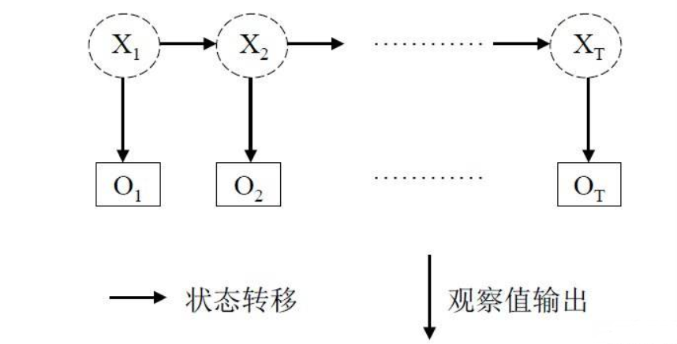

# 60分钟看懂HMM的基本原理


HMM模型，韩梅梅的中文拼音的缩写，所以又叫韩梅梅模型，由于这个模型的作者是韩梅梅的粉丝，所以给这个模型取名为HMM。开玩笑！

HMM模型，也叫做隐马尔科夫模型，是一种经典的机器学习序列模型，实现简单，计算快速，广泛用于语音识别，中文分词等序列标注领域。


下面通过一个村民看病的故事理解什么是HMM模型。

想象一个乡村诊所，村民的身体状况要么健康要么发烧，他们只有问诊所的医生才能知道是否发烧。

医生通过询问村民的感觉去诊断他们是否发烧。村民自身的感觉有正常、头晕或冷。

假设一个村民每天来到诊所并告诉医生他的感觉。村民的感觉只由他当天的健康状况决定。

村民的健康状态有两种：健康和发烧，但医生不能直接观察到，这意味着健康状态对医生是不可见的。

每天村民会告诉医生自己有以下几种由他的健康状态决定的感觉的一种：正常、冷或头晕。

于是医生会得到一个村民的感觉的观测序列，例如这样：{正常，冷，冷，头晕，冷，头晕，冷，正常，正常}。

但是村民的健康状态这个序列是需要由医生根据模型来推断的，是不可直接观测的。


这个村民看病的故事中由村民的健康状态序列和村民的感觉序列构成的系统就是一个隐马尔科夫模型(HMM)。

其中村民的健康状态序列构成一个马尔科夫链。其每个序列值只和前一个值有关，和其它值无关。由于这个马尔科夫链是隐藏的，不可以被直接观测到，

只能由其关联的村民的感觉序列来进行推断，因此叫做隐马尔科夫模型(HMM)。 


### 一，HMM模型的上帝视角


HMM模型是一个生成模型，描述了两个相关序列的依赖关系。

这两个相关序列称为状态序列$X_1,X_2,X_3,……,X_T$ 和 观测序列 $O_1,O_2,X_3,……,O_T$. 

其中状态序列在t时刻的值只和t-1时刻状态序列的取值有关，观测序列在t时刻的值只和t时刻观测序列的取值有关。





其联合概率函数如下：

$$P(O_1,O_2,O_3,……O_T,X_1,X_2,X_3,……,X_T) $$
$$ = P(X_1) P(O_1|X_1) P(X_2|X_1) P(O_2|X_2) P(X_3|X_2) P(O_3|X_3)……P(X_T|X_{T-1}) P(O_T|X_T)$$
$$ = P(X_1) P(O_1|X_1)  \prod_\limits{t=2}^{T} (P(X_t|X_{t-1}) P(O_t|X_t))$$

如果能够确定联合概率函数中的各个参数，那么HMM模型也就完全地确定了，我们就拥有了HMM模型描述的这个体系的上帝视角，可以用来计算任何关心的事件的概率，从而解决我们感兴趣的问题。


### 一，HMM的三大假设

<!-- #region -->
1，马尔科夫性假设：t时刻的状态出现的概率只和t-1时刻的状态有关。

$$P(X_t|X_{t-1}X_{t-2}……X_1) = P(X_t|X_{t-1})$$


2，齐次性假设：可以理解为时间平移不变性
$$P(X_t|X_{t-1}) = P(X_s|X_{s-1})$$ 

$$(如果 X_t==X_s 且 X_{t-1}==X_{s-1}) $$


3，观测独立性假设：某个时刻t的观测值只依赖于该时刻的状态值，与任何其它时刻的观测值和状态值无关。

$$P(O_t|X_t X_{t-1}X_{t-2}……X_1,O_{t-1}O_{t-2}……O_1) = P(O_t|X_t)$$


<!-- #endregion -->

上述HMM的联合概率函数中，实际上就用到了HMM的三大假设。
$$P(O_1,O_2,O_3,……O_T,X_1,X_2,X_3,……,X_T)$$
$$= P(X_1,O_1,X_2,O_2,X_3,O_3,……,X_T,O_T)$$
$$= P(X_1)P(O_1|X_1)P(X_2|X_1 O_1)P(O_2|X_2 X_1 O_1)……P(X_T|X_{T-1} O_{T-1}……X_1O_1)P(O_T|X_T O_{T-1}X_{T-1}……O_1 X_1)$$
$$= P(X_1) P(O_1|X_1) P(X_2|X_1) P(O_2|X_2) P(X_3|X_2) P(O_3|X_3)……P(X_T|X_{T-1}) P(O_T|X_T)$$

```python

```

### 二，HMM的三要素


观察HMM的联合概率函数：

$$P(O_1,O_2,O_3,……O_T,X_1,X_2,X_3,……,X_T) $$
$$ = P(X_1) P(O_1|X_1) \Pi_{t=2}^{T} P(X_t|X_{t-1}) P(O_t|X_t)$$

可以看到只依赖于三种概率值参数

$P(X_1)$, $P(X_t|X_{t-1})$, $P(O_t|X_t)$

分别是初始状态概率，状态值转移概率，观测值输出概率(发射概率)

这就是HMM的三要素，也就是HMM的全部参数，确定了这三种概率，HMM模型就完全确定下来了。

对于状态值取值和观测值取值为离散值的情况下，这三种概率可以表示为矩阵。

假定状态值可能的取值为  $x_1,x_2,……,x_M$，一共有M种可能取值。
观测值可能的取值为 $o_1,o_2,……,o_N$，一共有N种可能取值。

则HMM的全部参数可以表示为三个矩阵 $\lambda = (\pi, A, B)$

其中 $\pi$叫做初始概率矩阵，是一个M维向量， $\pi_i = P(x_i)$  

$A$叫做转移概率矩阵，是一个M×M维矩阵， $A_{ij} = P(x_j|x_i)$  

$B$叫做发射概率矩阵，是一个M×N维矩阵， $B_{ij} = P(o_j|x_i)$  
 
 


以上面村民看病的例子为例，假设这三个矩阵分别为：

```python
pi = {'Healthy': 0.6, 'Fever': 0.4} #初始状态矩阵


A = {
   'Healthy' : {'Healthy': 0.7, 'Fever': 0.3},
   'Fever' : {'Healthy': 0.4, 'Fever': 0.6},
   } #状态矩阵

B =  {
   'Healthy' : {'normal': 0.5, 'cold': 0.4, 'dizzy': 0.1},
   'Fever' : {'normal': 0.1, 'cold': 0.3, 'dizzy': 0.6},
} # 发射矩阵


```


```python

```

### 三，HMM的三个基本问题

<!-- #region -->
HMM模型相关的应用问题一般可以归结为这三个基本问题中的一个：

1，评估问题：已知模型参数 $\lambda = (A,B,\pi)$，和观测序列 $O = O_1,O_2,O_3,……,O_T$, 计算观测序列出现的概率。
以村民看病问题为例, 计算一个村民连续出现 {正常，冷，头晕} 感觉的概率。评估问题一般使用前向算法或者后向算法进行解决，其中前向算法相对简单，容易理解一些。后向算法较难理解。设想有两个描述两人语音的HMM模型，那么给一个新的语音序列，利用前向算法或者后向算法就可以计算这个语音序列更可能是哪个人的。

2，预测问题：也叫做解码问题。已知模型参数 $\lambda = (A,B,\pi)$，和观测序列 $O = O_1,O_2,O_3,……,O_T$, 计算该观测序列对应的最可能的状态序列。以村民看病问题为例，假设一个病人连续出现 {正常，冷，头晕} 的感觉，计算病人对应的最可能的健康状态序列。预测问题一般使用贪心近似算法或者维特比算法解决。其中贪心近似算法相对简单一些，但不一定能找到全局最优解。维特比算法可以找到全局最优，是一种动态规划算法。


3，学习问题：模型参数 $\lambda = (A,B,\pi)$ 未知，推断模型参数。有两种可能的场景，一种是监督学习的场景，已知诸多观测序列和对应的状态序列，推断模型参数，第二种是非监督学习的场景，只知道诸多观测序列，推断模型参数。监督学习的场景，学习方法相对简单。非监督学习的场景，一般使用EM期望最大化方法进行迭代求解。


<!-- #endregion -->

```python

```

### 四， 三个基本问题的简单解法


**1，评估问题的简单解法** 


已知模型参数 $\lambda = (A,B,\pi)$，和观测序列 $O = O_1,O_2,O_3,……,O_T$, 计算观测序列出现的概率。

评估问题一般使用前向算法或者后向算法进行解决，其中前向算法相对简单。

如果暴力求解，这个概率可以计算如下:

$$P(O_1,O_2,O_3,……,O_T)=  \sum_{X_1 = x_1}^{x_M}\sum_{X_2 = x_1}^{x_M}\sum_{X_3 = x_1}^{x_M}…\sum_{X_T = x_1}^{x_M}  P(X_1) P(O_1|X_1)  \prod_\limits{t=2}^{T} (P(X_t|X_{t-1}) P(O_t|X_t))$$

计算复杂度大约为 $T*M^T$

前向算法是一种递推算法，可以大大减少重复计算，降低计算复杂度。

构造序列$\alpha_t(X_t) = P(O_1,O_2,……,O_t,X_t)$

则初始值如下：

$\alpha_1(X_1) = P(O_1,X_1) = P(X_1)P(O_1|X_1) = \pi(X_1) B(X_1,O_1)$

而：
$$ \alpha_2(X_2) = P(O_1,O_2,X_2) = \sum_{X_1 = x_1}^{X_M} P(O_1,X_1) P(X_2|X_1) P(O_2|X_2)$$ 
$$= \sum_{X_1 = x_1}^{X_M} \alpha_1(X_1) A(X_1,X_2) B(X_2,O_2)$$ 

不难发现存在递推公式如下：

$$ \alpha_{t+1} (X_{t+1}) = P(O_1,O_2,……,O_{t+1},X_{t+1}) = \sum_{X_{t} = x_1}^{X_M} \alpha_{t}(X_{t}) P(X_{t+1}|X_t) P(O_{t+1}|X_{t+1})$$ 
$$= \sum_{X_t = x_1}^{X_M} \alpha_t(X_t) A(X_t,X_{t+1}) B(X_{t+1},O_{t+1})$$ 

通过$\alpha_t(X_t)$, 我们可以计算

$$P(O_1,O_2,O_3,……,O_T) = \sum_{X_T = x_1}^{X_M} \alpha_T(X_T)$$

计算复杂度已经降低为 $T*M^2$

```python

```

**2，预测问题的简单解法**

已知模型参数 $\lambda = (A,B,\pi)$，和观测序列 $O = O_1,O_2,O_3,……,O_T$, 计算该观测序列对应的最可能的状态序列。

预测问题一般使用贪心近似算法或者维特比算法解决。较常用的是维特比算法。但贪心近似算法更加简单，很多时候就已经足够使用。

其基本思想是贪心思想，每一个步骤都取相应的$X_i$, 使得对应输出的概率最大。

$X_1 = \mathop{argmax}_{X_i} P(X_i)P(O_1|X_i)$

$X_2 = \mathop{argmax}_{X_i} P(X_i|X_1)P(O_2|X_i)$

……

$X_T = \mathop{argmax}_{X_i} P(X_i|X_{T-1})P(O_T|X_i)$


```python

```

**3， 学习问题的简单解法**

模型参数 $\lambda = (A,B,\pi)$ 未知，推断模型参数。监督学习的场景，学习方法相对简单。已知诸多观测序列和对应的状态序列，推断模型参数。

这种情况下可以统计相应的频率作为$\pi$, $A$, $B$中各个概率的估计值。


```python

```

```python

```

### 五， 三个基本问题的复杂解法

<!-- #region -->
**1，评估问题的复杂解法**

已知模型参数 $\lambda = (A,B,\pi)$，和观测序列 $O = O_1,O_2,O_3,……,O_T$, 计算观测序列出现的概率。

除了前向算法，还有一种后向算法，功能和前向算法相当，也是使用递推法实现的，但没有前向算法那么直观。

构造序列$\beta_t(X_t) = P(O_{t+1},……,O_{T-1},O_T|X_t)$

我们规定 $\beta_T(X_T) = 1$ 对任何$X_T$都成立。

类似地我们可以发现后向递推关系：

$$\beta_t(X_t) =  P(O_{t+1},……,O_{T-1},O_T|X_t) = \sum_{X_{t+1} = x_1}^{x_M} P(X_{t+1}, O_{t+1},……,O_{T-1},O_T|X_t)$$

$$= \sum_{X_{t+1} = x_1}^{x_M} P( O_{t+1},……,O_{T-1},O_T|X_{t+1},X_t)P(X_{t+1}|X_t)$$


$$= \sum_{X_{t+1} = x_1}^{x_M} P( O_{t+1},……,O_{T-1},O_T|X_{t+1})P(X_{t+1}|X_t)$$

$$= \sum_{X_{t+1} = x_1}^{x_M} P( O_{t+2},……,O_{T-1},O_T|X_{t+1}) P( O_{t+1}|X_{t+1}) P(X_{t+1}|X_t)$$

$$= \sum_{X_{t+1} = x_1}^{x_M} \beta_{t+1}(X_{t+1}) B(X_{t+1},O_{t+1}) A(X_t,X_{t+1})$$


通过$\beta_1(X_1)$, 我们可以计算

$$P(O_1,O_2,O_3,……,O_T) = \sum_{X_1 = x_1}^{X_M} P(X_1)P(O_1|X_1) \beta_1(X_1)$$

$$ = \sum_{X_1 = x_1}^{X_M} \pi(X_1)B(X_1,O_1) \beta_1(X_1)$$

<!-- #endregion -->

**2，预测问题的复杂解法**

已知模型参数 $\lambda = (A,B,\pi)$，和观测序列 $O = O_1,O_2,O_3,……,O_T$, 计算该观测序列对应的最可能的状态序列。

解决这一预测问题较常用的方法是维特比算法，是一种动态规划算法，也可以理解成一种搜索空间的剪枝方法，可以保证找到全局最优路径。

不同于贪心近似算法在每个步骤只保留一条当前最优路径，维特比算法在每个步骤会保留若干条当前最优路径，这些最优路径和每个步骤的最后一个隐含状态值的可能取值相对应，如果状态值有M个可能取值，则每个步骤保留M条当前最优路径。

由于HMM的马尔科夫性质，之后的概率计算只和最后一个隐藏状态取值相关，因此全局的最优路径必定在这M条当前最优路径中，如此递推不断向前寻找M个隐状态值对应的M条当前最优路径，最后取最终得到的M条当前最优路径中概率最大的那条作为全局最优路径。


```python

```

**3，学习问题的复杂解法**

模型参数 $\lambda = (A,B,\pi)$ 未知，推断模型参数。

这是一个存在隐变量的概率模型的参数估计问题，一般使用EM期望最大化算法进行求解。

原始问题可以定义为 

$$\mathop{argmax}_{\lambda} \mathop{\ln} P(O_1,O_2,O_3,……,O_T;\lambda)$$

根据期望最大化算法的算法原理，可以得到迭代条件如下：


$$\pmb{\lambda}^{\{n+1\}} = \mathop{argmax}_{\pmb{\lambda}}\sum_{X_1}……\sum_{X_T}P(X_1,X_2,……,X_T\,|\,O_1,O_2,……,O_T;\pmb{\lambda}^{\{n\}}) \ln P(X_1,X_2,……,X_T,O_1,O_2,……,O_T;\pmb{\lambda})$$

$$ = \mathop{argmax}_{\pmb{\lambda}}\sum_{X_1}……\sum_{X_T}P(X_1,X_2,……,X_T\,|\,O_1,O_2,……,O_T;\pmb{\lambda}^{\{n\}}) \ln (P(X_1) \prod_\limits{t=2}^{T} P(X_t|X_{t-1})  \prod_\limits{t=1}^{T}  P(O_t|X_t)) $$

$$ = \mathop{argmax}_{\pmb{\lambda}}\sum_{X_1}……\sum_{X_T}P(X_1,X_2,……,X_T\,|\,O_1,O_2,……,O_T;\pmb{\lambda}^{\{n\}}) \ln (\pi(X_1) \prod_\limits{t=2}^{T} A(X_{t-1},X_t)  \prod_\limits{t=1}^{T}  B(X_t,O_t)) $$

$$ = \mathop{argmax}_{\pmb{\lambda}}\sum_{X_1}……\sum_{X_T}P(X_1,X_2,……,X_T\,|\,O_1,O_2,……,O_T;\pmb{\lambda}^{\{n\}}) \ln \pi(X_1)$$ 
$$+ \mathop{argmax}_{\pmb{\lambda}}\sum_{X_1}……\sum_{X_T}P(X_1,X_2,……,X_T\,|\,O_1,O_2,……,O_T;\pmb{\lambda}^{\{n\}})  \sum_{t=2}^{T} \ln A(X_{t-1},X_t) $$
$$+ \mathop{argmax}_{\pmb{\lambda}}\sum_{X_1}……\sum_{X_T}P(X_1,X_2,……,X_T\,|\,O_1,O_2,……,O_T;\pmb{\lambda}^{\{n\}})  \sum_{t=1}^{T}  \ln B(X_t,O_t)) $$ 


于是可以得到三个参数 $\pi, A,B$ 的 迭代条件：

$$\pi^{\{n+1\}} = \mathop{argmax}_{\pi}\sum_{X_1}……\sum_{X_T}P(X_1,X_2,……,X_T\,|\,O_1,O_2,……,O_T;\pmb{\lambda}^{\{n\}}) \ln \pi(X_1)$$ 

$$A^{\{n+1\}} = \mathop{argmax}_{\pi}\sum_{X_1}……\sum_{X_T}P(X_1,X_2,……,X_T\,|\,O_1,O_2,……,O_T;\pmb{\lambda}^{\{n\}})  \sum_{t=2}^{T} \ln A(X_{t-1},X_t) $$

$$B^{\{n+1\}} = \mathop{argmax}_{\pi}\sum_{X_1}……\sum_{X_T}P(X_1,X_2,……,X_T\,|\,O_1,O_2,……,O_T;\pmb{\lambda}^{\{n\}})  \sum_{t=2}^{T} \ln B(X_{t-1},X_t) $$

其中 $P(X_1,X_2,……,X_T\,|\,O_1,O_2,……,O_T;\pmb{\lambda}^{\{n\}})$ 不含待优化参数，考虑概率之和为1的约束，可以构造拉格朗日乘子法进行求解，过程较为繁琐，从略。


```python

```

参考文章：

《一站式解决：隐马尔可夫模型（HMM）全过程推导及实现》：https://zhuanlan.zhihu.com/p/85454896 

《机器学习：HMM原理及其实践》：https://www.cnblogs.com/zhangxinying/p/12071061.html

《概率图模型体系：HMM、MEMM、CRF》：https://zhuanlan.zhihu.com/p/33397147

